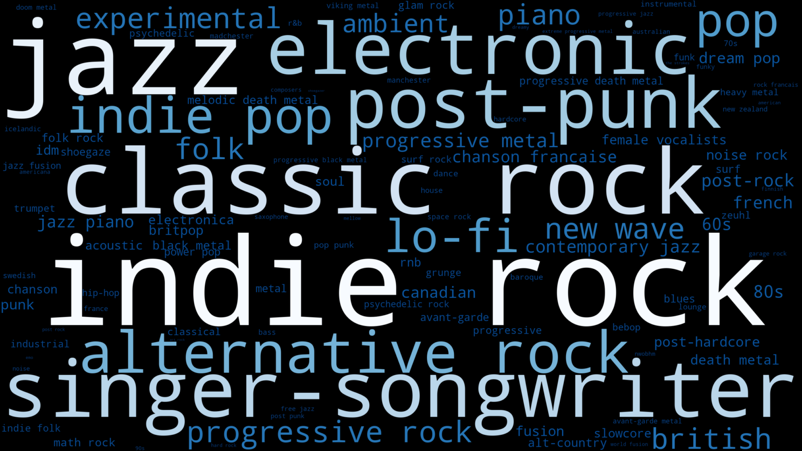

# lastfm-wordcloud

Script to generate a wordcloud with tags from artists listened by a Last.fm user.

The script needs a valid config file with your lastfm API keys (get them at last.fm/api.) in a `config.ini` file (see `config_sample.ini` for an example).



## Requirements

- pylast
- tqdm
- wordcloud

The script will extract the top X tags (default 4) for the most listened artists (default 50) over the selected timeframe (default 7day) for a Last.fm user.

You can add tags to the `forbidden_tags.txt` to ignore some tags.

The wordcloud will be generated using those tags weighted accordingly to both the other tags of the artist and the artist position in the ranking.

The wordcloud will be colored according to a matplotlib colormap (default `Blues`) and be exported into a 2560x1440 image.

## Usage

```
python lastfm-wordcloud-tags.py -u USERNAME -t overall
```

## Help

```
python lastfm-wordcloud-tags.py -h
```

```
usage: lastfm-wordcloud-tags.py [-h] [--debug] [--username USERNAME]
                                [--timeframe TIMEFRAME]
                                [--artists_count ARTISTS_COUNT]
                                [--top_tags_count TOP_TAGS_COUNT]

Create a wordcloud of the genres listened by one or several lastfm users.

options:
  -h, --help            show this help message and exit
  --debug               Display debugging information.
  --username USERNAME, -u USERNAME
                        Usernames, separated by comma.
  --timeframe TIMEFRAME, -t TIMEFRAME
                        Timeframe (Accepted values : 7day, 1month, 3month,
                        6month, 12month, overall. Default : 7day).
  --artists_count ARTISTS_COUNT, -a ARTISTS_COUNT
                        Number of artists to extract (default 10).
  --top_tags_count TOP_TAGS_COUNT, -g TOP_TAGS_COUNT
                        Number of top tags to take into account by artist
                        (default 4).
```
